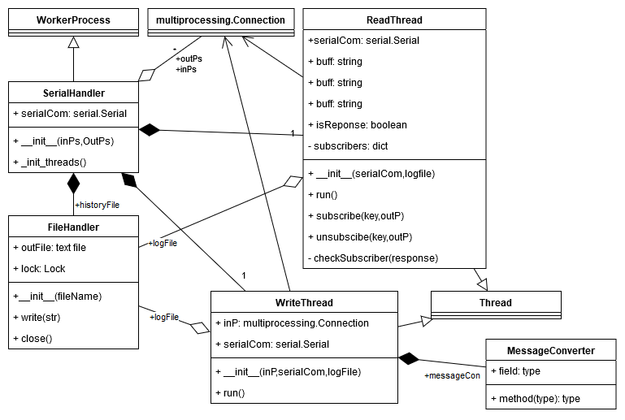

Serial Handler
===============

This documentation part enumerates the classes used for interacting with an other micro-controller via serial communication interface. 
The SerialHandler is the main class, which has two independent thread, ReadThread and WriteThread, one for reading and one for writing. 
The MessageConverter class describes the message encoding mechanism used between the devices, it contains the all predefined action and message pairs. 

.. automodule:: src.hardware.serialhandler.serialhandler
.. automodule:: src.hardware.serialhandler.readthread
.. automodule:: src.hardware.serialhandler.writethread
.. automodule:: src.hardware.serialhandler.messageconverter
    