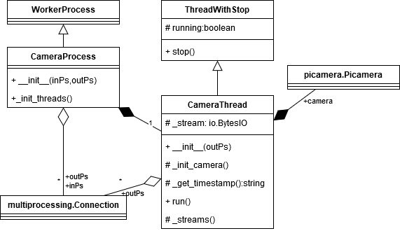
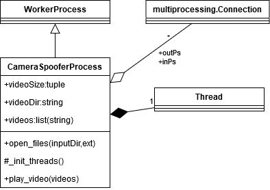

Hardware layer
================

Here you can find the element of the hardware layer, which have functionality to create an interface between the hardware component and other parts of the code.
This layer contains two interface: CameraHandler and SerialHandler. CameraHandler interface controls the camera parameters and captures the frames, 
which transfers to other workers. The serialHanlder communicates with the micro-controller via a serial communication interface and based on predefined 
message encoding mechanism.

Camera Handler Process
-----------------------

  
In this section, you can find the documentation of the camera handler, which is built from the CameraProcess and the CameraThread or by a CameraSpooferProcess. 
The CameraProcess is a base processes, which contains the CameraThread. The CameraThread sets the camera parameter and capture the frame to transfer to the
other workers (thread or processes) via pipes (in this case, the CameraStreamerProcess. 
It can handle multiple connection, so it can send the frame to multiple workers.

The CameraSpooferProcess has the same functionality of the CameraProcess and CameraThread, except is forwards a list of videos, not the camerastream.

.. automodule:: src.hardware.camera.CameraProcess
.. automodule:: src.hardware.camera.CameraThread

Serial Handler Process
------------------------

This documentation part enumerates the classes used for interacting with an other micro-controller via serial communication interface. 
The SerialHandlerProcess is the main class, which has two independent thread, ReadThread and WriteThread. The ReadThred handles the reading 
of the messages from the embedded project, like 'ok' messages, position of encoder or others. The WriteThread handles the sending of the 
messages. The already present implementation of the messages are defined in the messageconverter. 
The serialhandler stores also the exchanged messages in a log file, handled by the filehandler.

.. image:: diagrams/pics/ClassDiaStartUp_SerialHandler.png
    :align: center

.. automodule:: src.hardware.serialhandler.SerialHandlerProcess
.. automodule:: src.hardware.serialhandler.ReadThread
.. automodule:: src.hardware.serialhandler.WriteThread
.. automodule:: src.hardware.serialhandler.messageconverter

Camera Spoofer Process
------------------------

CameraSpooferProcess is a video streamer process, which comunicate with other workers similarly to the CameraProcess, so it can be replaced 
with Camera spoofer worker for displaying the recording the frames.  

.. automodule:: src.hardware.camera.CameraSpooferProcess