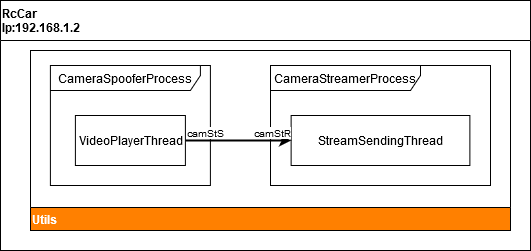

Utils layer
===========

Remote car control
---------------------

In this section is presented the architecture of the main development tools, Camera Streamer and Remote Control. The following figure shows the structure of our application, where the remote controller and the camera streamer features are activated and connected to a remote device. 
On the RaspberryPi (RcCar) the following processes run: CameraProcess and SerialHandler ('hardware' package), CameraStreamer and RemoteControlReceiver ('utils' package). Each process contains minimum one thread, these threads are symbolized by rectangles and the communication (multiprocess Pipes and sockets) between them by arrows. 

On the remote device run the camera receiver and the remote control transmitter processes (bin package), where the Remote control transmitter process contains two thread, SendCommand and KeyboardListener. 
The third shown object just implements a state machine for the keyboard controller, it is not the independent thread. It generates the message based on keyboard event by applying `getMessage` method.

.. image:: diagrams/pics/ComponentDia_StartUp.png
    :align: center

On the second image a simple structure is presented, which shows the mode of usage for steaming the recording videos by 'CameraSpoofer' process. 
In this case the `enableStream` and `enableCameraSpoof` flags have to enable, where the `CameraProcess` will be in replaced by 'CameraSpoofer' process. 
It will work similarly to the `CameraProcess`, only will play the stored videos.

